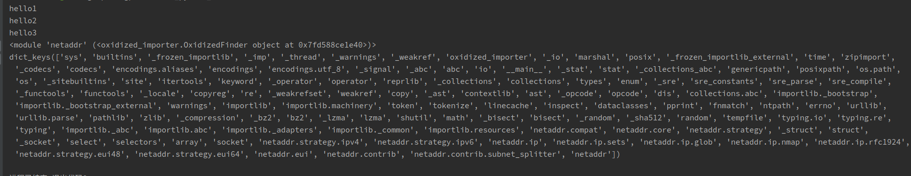

I have an old python project (which I don't maintain either) and I want to modularize its
functionality and integrate it into rust code, something like the following example
Later I may package this project as a lib and load it into other rust projects


## Generic embedded python parser (Current Status)

> 

1. Normal manual generation of examples.

```shell
pyoxidizer generate-python-embedding-artifacts --system-rust --target-triple x86_64-unknown-linux-gnu target/pyembedded
```

2. Compile the finished product.

```shell
PYO3_CONFIG_FILE=$(pwd)/target/pyembedded/pyo3-build-config-file.txt cargo run
```

Summary of the problems encountered.

1. redundancy of compilation commands, although the PYO3_CONFIG_FILE environment variable can be set via the config.toml configuration file, the first command has to be used to create the default python parser file.
2. unable to add third-party libraries to python, can only call standard library modules


## The state that I expect or that I try to achieve


From the command line `pyoxidizer generate-python-embedding-artifacts`, we know that the embedding is created by the `generate_python_embedding_artifacts` function in the `projectmgmt.rs` file in the `pyoxidizer` package.

After reading the source code and looking up the relevant documentation, no solution was found.


Then I tried to use a curved approach: importing the dependency `pyoxidizer` in `build.rs`, and rewriting a function that can be customized to add a library or dependency and package it before the official build


Refer to build.rs for details


```shell
cargo run --package customize_python_embedded --bin customize_python_embedded
```

The experimental results do not match the expected results

error info:
```log
Python path configuration:
  PYTHONHOME = '/mnt/work/code/Me/Rust/customize_python_embedded/target/debug'
  PYTHONPATH = (not set)
  program name = '/mnt/work/code/Me/Rust/customize_python_embedded/target/debug/customize_python_embedded'
  isolated = 0
  environment = 1
  user site = 1
  import site = 1
  sys._base_executable = '/mnt/work/code/Me/Rust/customize_python_embedded/target/debug/customize_python_embedded'
  sys.base_prefix = '/mnt/work/code/Me/Rust/customize_python_embedded/target/debug'
  sys.base_exec_prefix = '/mnt/work/code/Me/Rust/customize_python_embedded/target/debug'
  sys.platlibdir = 'lib'
  sys.executable = '/mnt/work/code/Me/Rust/customize_python_embedded/target/debug/customize_python_embedded'
  sys.prefix = '/mnt/work/code/Me/Rust/customize_python_embedded/target/debug'
  sys.exec_prefix = '/mnt/work/code/Me/Rust/customize_python_embedded/target/debug'
  sys.path = [
    '/mnt/work/code/Me/Rust/customize_python_embedded/target/debug/lib/python39.zip',
    '/mnt/work/code/Me/Rust/customize_python_embedded/target/debug/lib/python3.9',
    '/mnt/work/code/Me/Rust/customize_python_embedded/target/debug/lib/python3.9/lib-dynload',
  ]
Error: MainPythonInterpreter Init

Caused by:
    during initializing Python main: init_fs_encoding: failed to get the Python codec of the filesystem encoding
```

Analysis from the logs shows that the correct parser configuration file was not found

Ok, Let's try installing it again by means of environment variables

```shell
PYO3_CONFIG_FILE=$(pwd)/target/pyembedded/pyo3-build-config-file.txt cargo run
```

As shown in the figure, the third-party package resources have been loaded into the program



However, there is no way to use cargo run directly, you must use cargo run with PYO3_CONFIG_FILE environment variable, and the most painful thing is that you can't use cargo run with PYO3_CONFIG_FILE environment variable directly without generating pyembedded resource file.


To summarize, the modified example packaging process:

1. The first step is to download and generate python resource files.(It's definitely not working anyway, because the python parser config cannot be found)
```shell
cargo run
```

2. The python resource already exists, so compile it directly and succeed
```shell
PYO3_CONFIG_FILE=$(pwd)/target/pyembedded/pyo3-build-config-file.txt cargo run
```

I still feel very complicated, is there a good way to get everything I want by just running cargo run
